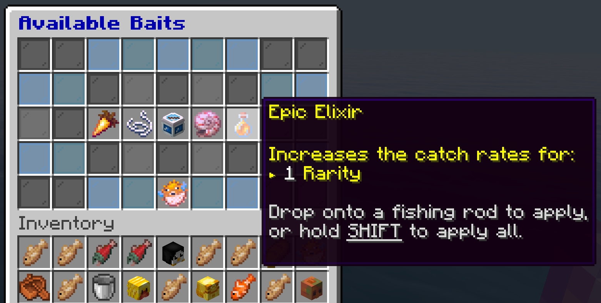

## The files
As of EvenMoreFish 2.0, all bait configs are located in `plugins/EvenMoreFish/baits`.



## Creating Baits
To create a new bait, you need to create a new yml file in the baits folder.

The following configs are required in each bait config file:
- `id` - Allows the plugin to identify this bait.

All other configs are optional, however you will most likely want to add fish and rarities to your bait. You can see how to do this in the example file.

## Disabling Baits
To disable a bait, you have two choices:
- Set `disabled` to true inside the file and reload.
- Rename the file to start with an underscore.

Doing either of these will prevent the bait from being registered into the plugin.

## Purchasing Baits
As of EvenMoreFish 2.1.6, you can set up baits to be purchased from the baits menu.

Doing this is very simple, you just add the following config options to your bait file:
```yaml
# Control whether this bait can be sold in the bait menu.
purchase:
  # The price this bait can be purchased for.
  # This can be set to 0 to make the bait free. -1 will disable purchasing.
  price: 50
  # The amount of this bait that is given when purchased.
  # This is automatically limited to the maximum stack size of the item.
  quantity: 1
```

After this, the bait can be clicked inside the baits menu to be purchased by the player.

## Example Config
An example config will always be available inside your baits folder, and contains every possible config option.
This file will reset every time the plugin loads, meaning it will always be up to date.

You can view this example file [here](https://github.com/EvenMoreFish/EvenMoreFish/blob/master/even-more-fish-plugin/src/main/resources/baits/_example.yml)