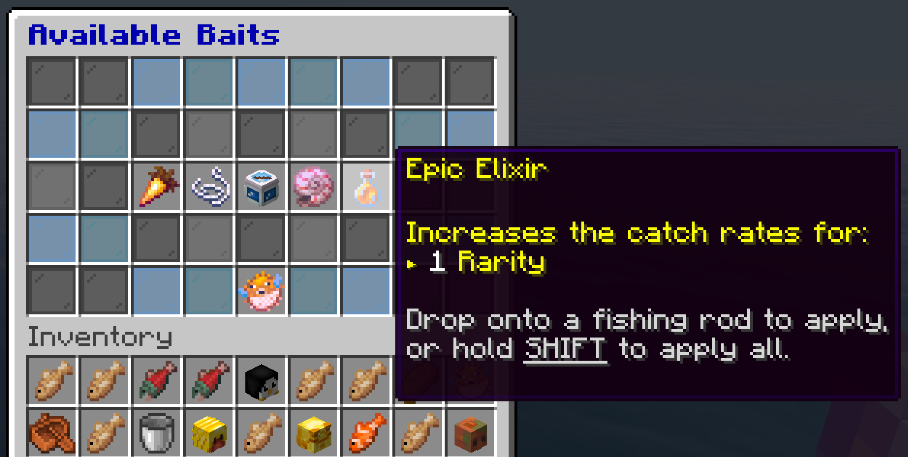

## The files
As of EvenMoreFish 2.0, all bait configs are located in `plugins/EvenMoreFish/baits`.



## Creating Baits
To create a new bait, you need to create a new yml file in the baits folder.

The following configs are required in each bait config file:
- `id` - Allows the plugin to identify this bait.

All other configs are optional, however you will most likely want to add fish and rarities to your bait. The current format uses `rarity-modifiers` and `fish-modifiers` so you can directly control how weights are changed.

## Modifiers
Baits can modify either whole rarities or specific fish.

Bare numbers are treated as additive boosts. Modifier expressions also support:
- `+N` to add weight
- `-N` to subtract weight
- `*N` to multiply weight
- `/N` to divide weight

Example:
```yaml
# Modify rarity weights directly.
rarity-modifiers:
  Epic: "+50"
  Legendary: "*2"

# Modify individual fish weights inside their rarity.
fish-modifiers:
  Common:
    Carp: "+25"
    Bluefish: "*2"
    Haddock: "-5"
  Rare:
    Sunfish: "+15"
    Goldfish: "/2"
    Nemo: "*3"
```

## Pre-2.3.0 Format Migration
Bait files created before `2.3.0` may still use the old `rarities` and `fish` sections.

Those files are now migrated automatically when the bait is loaded. Pre-`2.3.0` entries are converted to the new modifier format using the global `bait.boost` value from `config.yml`, then the old keys are removed from the file.

## Debug Commands
You can inspect the resolved bait chances with the admin debug command:

- `/emf admin bait debug <bait>` shows the debug output for yourself.
- `/emf admin bait debug <bait> <target>` shows the debug output for another player.

This is useful for checking the final rarity and fish chances after bait modifiers are applied.

## Disabling Baits
To disable a bait, you have two choices:
- Set `disabled` to true inside the file and reload.
- Rename the file to start with an underscore.

Doing either of these will prevent the bait from being registered into the plugin.

## Purchasing Baits
As of EvenMoreFish 2.1.6, you can set up baits to be purchased from the baits menu.

Doing this is very simple, you just add the following config options to your bait file:
```yaml
# Control whether this bait can be sold in the bait menu.
purchase:
  # The price this bait can be purchased for.
  # This can be set to 0 to make the bait free. -1 will disable purchasing.
  price: 50
  # The amount of this bait that is given when purchased.
  # This is automatically limited to the maximum stack size of the item.
  quantity: 1
  # The economy types to use for purchasing.
  # Optional. If not set, all available types will be required.
  economy-types: 
    - vault
    - playerpoints
```

After this, the bait can be clicked inside the baits menu to be purchased by the player.

## Example Config
An example config will always be available inside your baits folder, and contains every possible config option.
This file will reset every time the plugin loads, meaning it will always be up to date.

You can view this example file [here](https://github.com/EvenMoreFish/EvenMoreFish/blob/master/even-more-fish-plugin/src/main/resources/baits/_example.yml)
